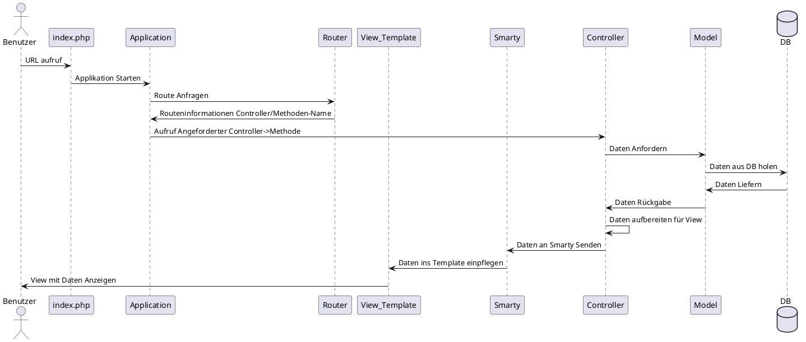

## MVC Framework Diagramm

## MVC Framework erklärung

Wenn der User eine URL der Webseite aufruft ruft er das File index.php auf, in welchem alle Routen gespeichert sind mittels des Router files. Dann ruft das index.php file die Application Klasse auf worin dann auf den Router zugegriffen wird und so alle Routen überprüft werden können ob die angeforderte URL auch dabei ist wenn dem so ist, bekommt die Application Klasse vom Router gleich den zuständigen Controller und die geforderte Methode darin geliefert diese wird dann gleich ausgeführt. Ab hier befinden wir uns im Normalen MVC Ablauf das bis hier hin war im Prinzip das eigentliche Framework. Der Controller vordert dann vom Model die Daten dieses holt diese mithilfe vom Model.php in welchem die Datenbank aufrufe bereist vorgefertigt sind ebenso wird hier noch die Hilfsklasse DBH verwendet um die Verbindung zur Datenbank zu ermöglichen, wenn das Model dann die Daten von der DB erhalten hat werden diese an den Controller weitergegeben und von diesem Vorbereitet und danach an den View also an das View-Template weitergegeben welches dann am User angezeigt wird.

## Datenbank ERD

##  Datenbank Entitäten erklärung

### Threads
Threads sind die eigentlichen Fragen sie beinhalten eine ID ebenso die userId als Foreign key vom User welcher den Thread erfasst hat, ausserdem noch einen Zeitstempel und die Kategorie welche eingegeben wurde. Natürlich sind auch noch Titel und Text vorhanden. Für die Tags gibt es eine eigene Zwischentabelle.

### Posts
Posts sind die Antworten auf die Threads daher haben sie nicht nur ihre eigene Id sondern auch noch eine ThreadId welche auf den Thread zeigt unter welchem sie verfasst wurden. Natürlich haben sie auch eine UserId, ein Zeitstempel und einen Text (einen Titel brauchen sie nicht). Damit man auch auf Antworten antworten kann und so diese hirarchisch abstufen kann, habe ich hier noch einen AnswerId hinzugefügt welche im Prinzip einfach die PostId vom übergeordneten Post ist.

### Benutzer
Benutzer sind die User des Forums sie haben eine id einen Nutzernamen (login) ein Passwort sowie Name, Vorname und Mail ebenso haben sie noch zwei Felder mit letztem login womit man auslesen könnte wann sie zuletzt online warum (diese funktion wurde nicht umgesetzt) und wann sie sich registriert haben(Dies wird bei den Posts angezeigt um zu sehen seit wann ein User Mitglied im Forum ist).

### Kategorie
Eine Kategorie enthält nur einen Namen und die Anzahl Threads welche ihr zugeordnet wurden um eine Abfrage der Anzahl Threads einfacher zu gestalten.

### Tags
Tags haben eine ID und einen Namen mehr nicht

### ThreadTags
ThreadTags ist eine Zwischentabelle für Threads und Tags da ein Tag mehrere Threads haben kann aber eben auch ein Thread mehrere Tags, daher wird diese Tabelle verwendet mit einer Id und jeweils vom Thread und dem Tag noch die Id damit man diese auch richtig zuordnen kann.

## Klassenmodel

### Alle Klassen

### Models

### Design Pattern
Als Design Pattern bei den Models wurde das ActiveRecord Pattern eingesetzt hiermit erspart man sich das ständige neu schreiben von Datenbank-Befehlen indem man diese bereits in der Übergeordneten Klasse definiert und diese dann im Child aufrufen kann auch wenn es viele Models sind.

Bei der Datenbank Anbindung wurde noch das Singleton Pattern verwendet im sicher zu stellen, dass nur eine Verbindung zur DB besteht und nicht mehrere denn dafür ist das Pattern da um genau dies zu tun um sicher zu stellen, dass nur eine einzige instanz des Objektes existiert. 

## Sicherheitskonzept

Das verhindern von Session Hijaking kann in diesem Projekt nur bedingt angewendet werden, da die beste Methode die verschlüsselung der Kommunikation ist also https was bei so einem Lokalen Projekt nicht umsetzbar ist. Betreffend  Session Id erraten dies wird verhindert indem wir das ganze über die von PHP bereitgestellte Methode session_start() regeln.

## Testing

| ID | Bezeichnung | Erwartetes Ergebnis | Ergebnis | Massnahme |
| ----------- | ----------- | ----------- | ----------- | ----------- |
| T001 | Nicht eingeloggte Benutzer werden stets auf die Login-Seite verwiesen | Verweis auf Login-Seite | Erfolgreich | Keine |
| T002 | Gast-Benutzer werden beim Aufruf von "Mein Profil" stets auf die Login-Seite verwiesen | Verweis auf Login-Seite | Erfolgreich | Keine |
| T003 | Alle Benutzer werden beim Aufruf einer f�lschlichen URL stets auf die Error-Seite verwiesen | Verweis auf Error-Seite | Erfolgreich | Keine |
| T004 | Ein Benutzer welcher sich korrekt einloggt wird stets auf die Home-Seite verwiesen | Verweis auf Home-Seite | Erfolgreich | Keine |
| T005 | Ein Benutzer welcher sich als Gast anmeldet wird stets auf die Home-Seite verwiesen | Verweis auf Home-Seite | Erfolgreich | Keine |
| T006 | Ein Benutzer welcher falsche Login-Daten eingibt wird stets darauf hingewiesen | "Try Again" wird auf der Login-Seite angezeigt | Erfolgreich | Keine |
| T007 | Durch den Click auf ein Musikst�ck wird dessen Detail-Ansicht angezeigt | Anzeigen der Detail-Ansicht | Erfolgreich | Keine |
| T008 | Ein eingeloggter Benutzer kann ein Musikst�ck Bewerten | Einf�gen der Bewertung in die DB | Erfolgreich | Keine |
| T009 | Durchschnittsbewertung eines Musikst�cks wird berechnet und angezeigt | Korrekte Durchschnittsbewertung wird angezeigt | Erfolgreich | Keine |
| T010 | Ein Gast-Benutzer kann ein Musikst�ck Bewerten | Einf�gen der Bewertung in die DB | Erfolgreich | Keine |
| T011 | Einem eingeloggten Benutzer werden seine bereits bewerteten Musikst�cke unter "Mein Profil"   -> "Meine Bewertungen" aufgelistet | Bereits bewertete Musikst�cke werden aufgelistet | Erfolgreich | Keine |
| T012 | Ein Musikst�ck, welches bereits vom eingeloggten Benutzer bewertet wurde,   soll dessen Bewertung bei der Detail-Ansicht gleich ins Formular laden | Bewertung vom eingeloggten Benutzer wird im Form angezeigt | Erfolgreich | Keine |
| T013 | Ein eingeloggter Benutzer kann ein bereits bewertetes Musikst�ck neu bewerten | Update der Bewertung in der DB | Alle Bewertungen des Benutzers werden geupdated | �ndern der SQL-Query die f�r das Update zust�ndig ist |
| T013b /T014 | Ein eingeloggter Benutzer kann ein bereits bewertetes Musikst�ck neu bewerten | Update der Bewertung in der DB | Erfolgreich | Keine |
| T015 | Die Suchfunktion listet die Musikst�cke auf, welche den Suchstring beinhalten | Musikst�cke, welche den Suchstring beinhalten, werden aufgelistet | Erfolgreich | Keine |
| T016 | Alle Kn�pfe/Formulare welche an weitere Methoden/Seiten weiterleiten funktionieren | Es wird verwiesen | Erfolgreich | Keine |

## Fazit

Da wir MVC jetzt bereits in mehreren Modulen verwendet haben, finde ich langsam immer mehr gefallen am Grundgedanke von MVC daher war die Entwicklung der eigentlichen Software mit dem MVC Pattern sehr angenehm, was eine grosse Herausforderung war, war die Entwicklung eines eigenen Frameworks hierbei merkt man gut warum es heute so viele Frameworks gibt und warum diese so beliebt sind, da man mit ihnen einfach viel weniger Arbeit hat und gleich loslegen kann und sich nicht noch um den ganzen Kram im Hintergrund kümmern muss, was schon sehr angenehm ist. Es hat aber auch seine Vorteile das Framework selber zu schreiben erstens man lernt das ganze viel besser kennen und weiss somit meistens schneller woher der Fehler stammt und sammelt sehr viel mehr Erfahrung, zweitens kann man das Framework so viel mehr auf die eigenen Bedürfnisse anpassen. Alles in allem war es ein Interessantes Projekt wo man bei Gelegenheit sicherlich noch die eine oder andere Funktionen einfügen könnte.