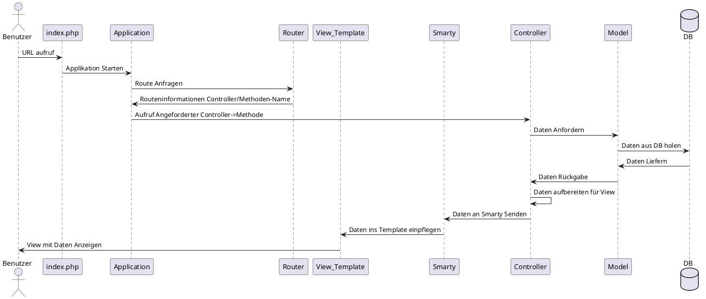
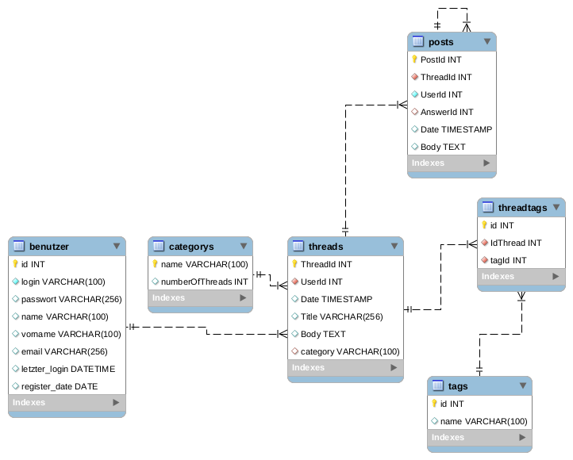
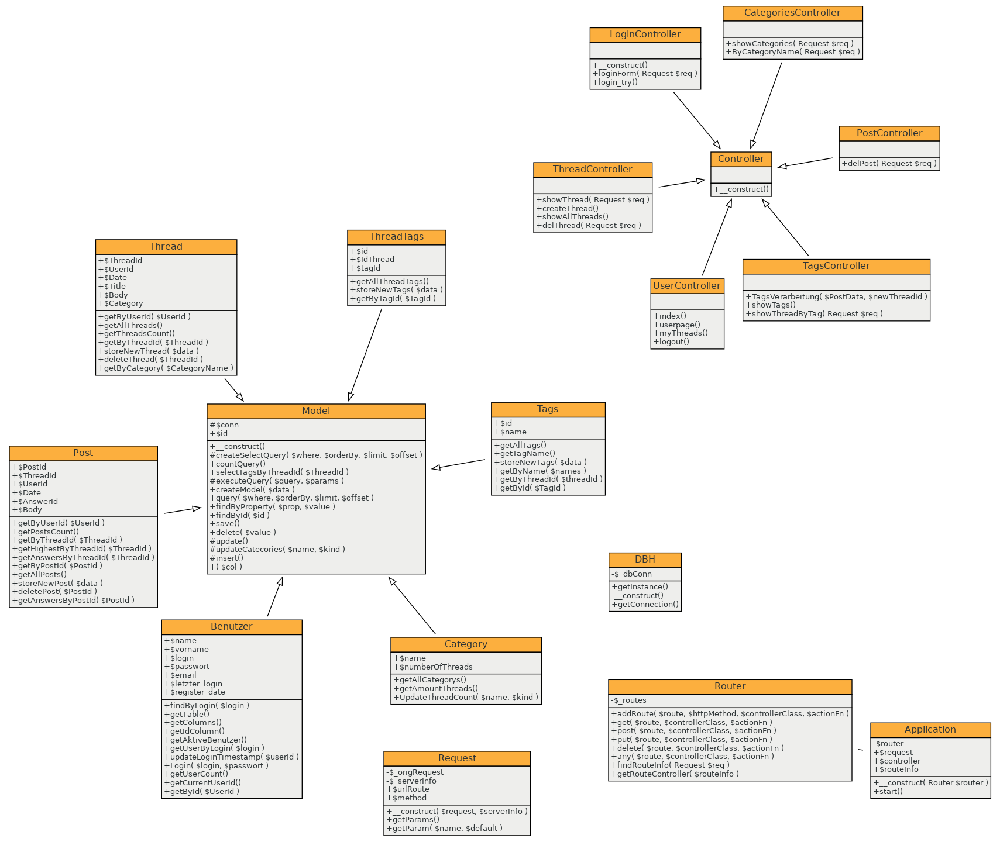
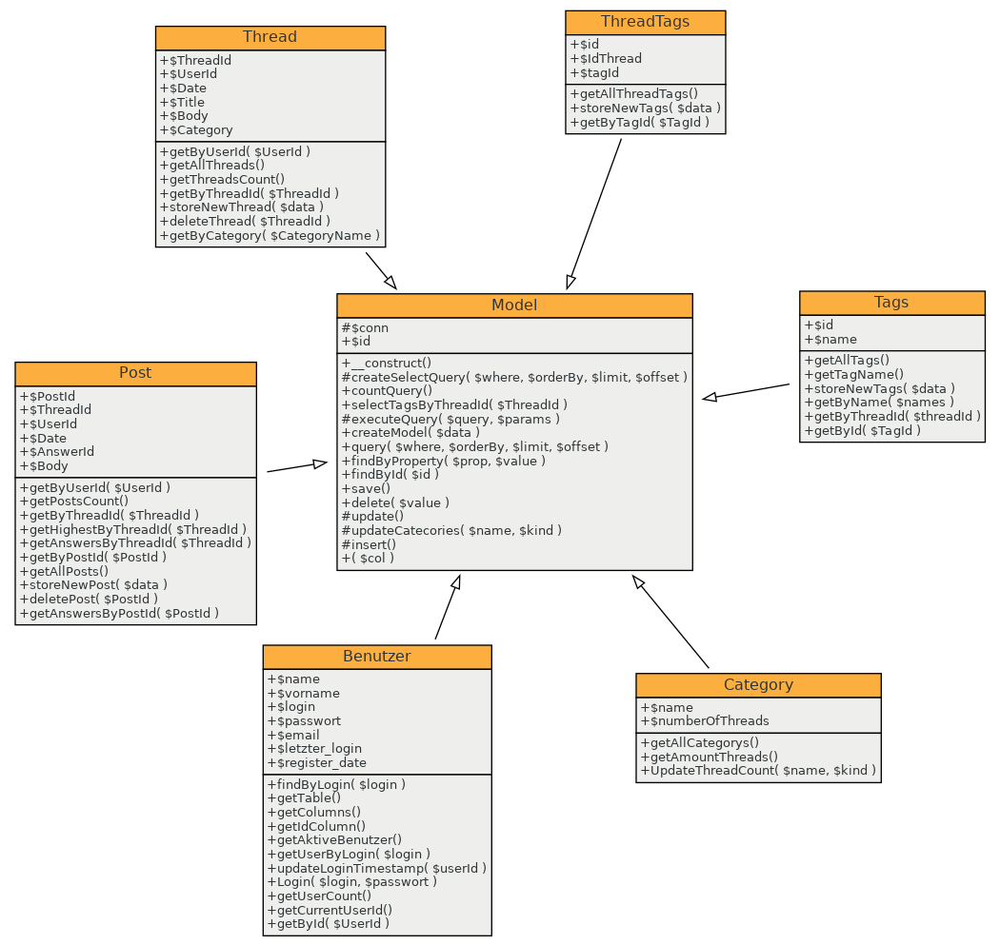

## MVC Framework Diagramm

## MVC Framework erklärung

Wenn der User eine URL der Webseite aufruft ruft er das File index.php auf, in welchem alle Routen gespeichert sind mittels des Router files. Dann ruft das index.php file die Application Klasse auf worin dann auf den Router zugegriffen wird und so alle Routen überprüft werden können ob die angeforderte URL auch dabei ist wenn dem so ist, bekommt die Application Klasse vom Router gleich den zuständigen Controller und die geforderte Methode darin geliefert diese wird dann gleich ausgeführt. Ab hier befinden wir uns im Normalen MVC Ablauf das bis hier hin war im Prinzip das eigentliche Framework. Der Controller vordert dann vom Model die Daten dieses holt diese mithilfe vom Model.php in welchem die Datenbank aufrufe bereist vorgefertigt sind ebenso wird hier noch die Hilfsklasse DBH verwendet um die Verbindung zur Datenbank zu ermöglichen, wenn das Model dann die Daten von der DB erhalten hat werden diese an den Controller weitergegeben und von diesem Vorbereitet und danach an den View also an das View-Template weitergegeben welches dann am User angezeigt wird.

## Datenbank ERD

##  Datenbank Entitäten erklärung

### Threads
Threads sind die eigentlichen Fragen sie beinhalten eine ID ebenso die userId als Foreign key vom User welcher den Thread erfasst hat, ausserdem noch einen Zeitstempel und die Kategorie welche eingegeben wurde. Natürlich sind auch noch Titel und Text vorhanden. Für die Tags gibt es eine eigene Zwischentabelle.

### Posts
Posts sind die Antworten auf die Threads daher haben sie nicht nur ihre eigene Id sondern auch noch eine ThreadId welche auf den Thread zeigt unter welchem sie verfasst wurden. Natürlich haben sie auch eine UserId, ein Zeitstempel und einen Text (einen Titel brauchen sie nicht). Damit man auch auf Antworten antworten kann und so diese hirarchisch abstufen kann, habe ich hier noch einen AnswerId hinzugefügt welche im Prinzip einfach die PostId vom übergeordneten Post ist.

### Benutzer
Benutzer sind die User des Forums sie haben eine id einen Nutzernamen (login) ein Passwort sowie Name, Vorname und Mail ebenso haben sie noch zwei Felder mit letztem login womit man auslesen könnte wann sie zuletzt online warum (diese funktion wurde nicht umgesetzt) und wann sie sich registriert haben(Dies wird bei den Posts angezeigt um zu sehen seit wann ein User Mitglied im Forum ist).

### Kategorie
Eine Kategorie enthält nur einen Namen und die Anzahl Threads welche ihr zugeordnet wurden um eine Abfrage der Anzahl Threads einfacher zu gestalten.

### Tags
Tags haben eine ID und einen Namen mehr nicht

### ThreadTags
ThreadTags ist eine Zwischentabelle für Threads und Tags da ein Tag mehrere Threads haben kann aber eben auch ein Thread mehrere Tags, daher wird diese Tabelle verwendet mit einer Id und jeweils vom Thread und dem Tag noch die Id damit man diese auch richtig zuordnen kann.

## Klassenmodel

### Alle Klassen

### Models

### Design Pattern
Als Design Pattern bei den Models wurde das ActiveRecord Pattern eingesetzt hiermit erspart man sich das ständige neu schreiben von Datenbank-Befehlen indem man diese bereits in der Übergeordneten Klasse definiert und diese dann im Child aufrufen kann auch wenn es viele Models sind.

Bei der Datenbank Anbindung wurde noch das Singleton Pattern verwendet im sicher zu stellen, dass nur eine Verbindung zur DB besteht und nicht mehrere denn dafür ist das Pattern da um genau dies zu tun um sicher zu stellen, dass nur eine einzige instanz des Objektes existiert. 

## Sicherheitskonzept

Das verhindern von Session Hijaking kann in diesem Projekt nur bedingt angewendet werden, da die beste Methode die verschlüsselung der Kommunikation ist also https was bei so einem Lokalen Projekt nicht umsetzbar ist. Betreffend  Session Id erraten dies wird verhindert indem wir das ganze über die von PHP bereitgestellte Methode session_start() regeln.

Ansonsten wurde natürlich noch die bekannte sql injection mittels Prepared Statements verhindert somit kann man nicht sql Code im input anhängen um diesen dann auf der Datenbank einfach ausführen zu lassen ohne, dass das gewollt ist vom Entwickler

## Testing
| ID   | Bezeichnung                                                  | Erwartetes Ergebnis                                          | Ergebnis    | Massnahme |
| ---- | ------------------------------------------------------------ | ------------------------------------------------------------ | ----------- | --------- |
| T1   | Nicht eingeloggte Benutzer sehen auf der Thread-Seite nur die Frage und einen Hinweis zum Login | Verweis auf Login-Seite/Eingeschränkte Nutzung               | Erfolgreich | Keine     |
| T2   | Eingeloggte Benutzer werden auf der Thread Seite auf das Fehlende Login aufmerksam gemacht und ebenso Einfärbung des Logos oben Links | Hinweis auf Login-Seite                                      | Erfolgreich | Keine     |
| T3   | Ein Benutzer welcher sich korrekt einloggt wird stets auf die Start-Seite verwiesen | Verweis auf Start-Seite                                      | Erfolgreich | Keine     |
| T4   | Wenn der User das Login falsch eingibt erhält er eine Meldung, dass es einen Login Fehler gab | "Username oder Passwort falsch" wird auf angezeigt           | Erfolgreich | Keine     |
| T5   | Auf der Start Seite wird eine Statistik angezeigt            | Die Statistik stimmt bei jedem Aufruf mit der Datenbank überein. | Erfolgreich | Keine     |
| T6   | Kategorie Übersicht stimmt                                   | Die Anzahl Beiträge auf der Kategorie Übersicht egal ob Startseite oder Kategorie-Seite ist Korrekt und Updated sich wenn ein neuer Beitrag erstellt wird | Erfolgreich | Keine     |
| T7   | Tags Übersicht                                               | Es werden alle Tags angezeigt auch neue welche hinzugefügt wurden | Erfolgreich | Keine     |
| T8   | Tags/Kategorie Einzelansicht                                 | Es werden alle Beiträge welche zur betreffenden Kategorie oder zum betreffenden Tag gehören angezeigt. | Erfolgreich | Keine     |
| T9   | Alle Beiträge                                                | Es werden alle Beiträge angezeigt                            | Erfolgreich | Keine     |
| T10  | Frage stellen                                                | Das Formular verlangt einen Titel und einen Body ebenso ist bereits Standartmässig die Kategorie Allgemein angewählt. | Erfolgreich | Keine     |
| T11  | Frage stellen (Tags)                                         | Man kann bis zu 5 Tags auswählen, entweder aus den bestehenden oder aber auch neue hinzufügen und diese werden dann auch bei späteren Aufrufen der Erstellen Seite angezeigt. | Erfolgreich | Keine     |
| T12  | Frage stellen                                                | Nach erfolgreichem absenden des Formulars wird man direkt zur Einzelansicht des neuen Threads weitergeleitet | Erfolgreich | Keine     |
| T13  | Einzelansicht Thread (Links)                                 | Die Links die bei Tags und Kategorie hinterlegt sind führen zur Übersicht der jeweiligen Kategorie/Tag | Erfolgreich | Keine     |
| T14  | Einzelansicht                                                | Der Thread wird korrekt dargestellt mit allen Informationen (Wer, Wann, Kat/Tags) | Erfolgreich | Keine     |
| T15  | Einzelansicht antworten                                      | Man kann mittels dem Button Antwort schreiben das Formular aufklappten und eine Antwort erfassen, welche nach absenden auch gleich ganz unten erscheinen wird. | Erfolgreich | Keine     |
| T16  | Einzelansicht Antworten antworten                            | Man kann auf eine Antwort antworten und auf diese ebenso und immer so weiter. | Erfolgreich | Keine     |
| T17  | Antwort löschen (ohne Antworten)                             | Wenn man der Verfasser der Antwort ist kann man diese über den Abfalleimer löschen. Diese wird dann nicht mehr angezeigt | Erfolgreich | Keine     |
| T18  | Antwort löschen (mit Antworten)                              | Der Verfasser löscht die Antwort und auch alle untergeordneten Antworten werden mit gelöscht. | Erfolgreich | Keine     |
| T19  | Frage löschen                                                | Der Verfasser löscht seine Frage und auch alle dazugehörigen Antworten werden gelöscht. | Erfolgreich | Keine     |
| T20  | Meine Beträge                                                | Es werden alle Fragen die man gestellt hat in einer Liste angezeigt | Erfolgreich | Keine     |
| T21  | Logout                                                       | Mit einem klick auf den Logout Button wird man ausgeloggt und auf die Start-Seite weitergeleitet | Erfolgreich | Keine     |

## Fazit

Da wir MVC jetzt bereits in mehreren Modulen verwendet haben, finde ich langsam immer mehr gefallen am Grundgedanke von MVC daher war die Entwicklung der eigentlichen Software mit dem MVC Pattern sehr angenehm, was eine grosse Herausforderung war, war die Entwicklung eines eigenen Frameworks hierbei merkt man gut warum es heute so viele Frameworks gibt und warum diese so beliebt sind, da man mit ihnen einfach viel weniger Arbeit hat und gleich loslegen kann und sich nicht noch um den ganzen Kram im Hintergrund kümmern muss, was schon sehr angenehm ist. Es hat aber auch seine Vorteile das Framework selber zu schreiben erstens man lernt das ganze viel besser kennen und weiss somit meistens schneller woher der Fehler stammt und sammelt sehr viel mehr Erfahrung, zweitens kann man das Framework so viel mehr auf die eigenen Bedürfnisse anpassen. Alles in allem war es ein Interessantes Projekt wo man bei Gelegenheit sicherlich noch die eine oder andere Funktionen einfügen könnte.