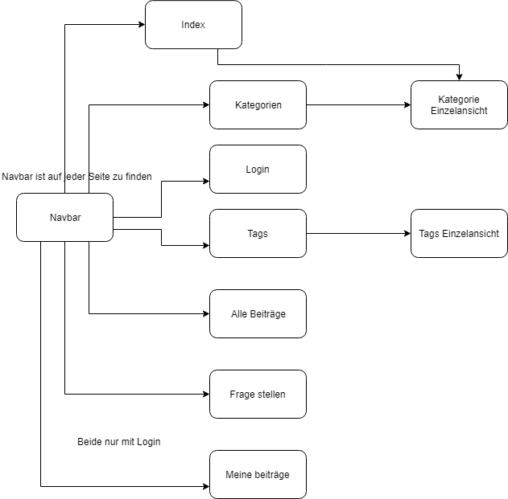

Pflichtenheft
==========

## Beschreibung

Kurz-Beschreibung: Ein Forum wo man Beiträge schreiben und auf andere antworten kann.

Beschreibung: Ein Forum mit verschiedenen Kategorien und Tags wo man sich einloggen muss um Beiträge zu schreiben und um die Antworten zu sehen. Die Fragen kann man auch ohne Login anschauen man sieht jedoch die Antworten nur wenn man eingeloggt ist. Beim erstellen eines Beitrages kann man die Kategorie wählen und Tags vergeben, mithilfe von diesen kann man dann die Beiträge finden und ähnliche Beiträge suchen. Ausserdem erhält man auf der Startseite eine kleine Statistik wie viele Fragen bereits gestellt wurden, wie viele Antworten es insgesamt gibt und wie viele Benutzer es gibt. Als eingeloggter Nutzer kann man auf Beiträge antworten aber auch auf Antworten antworten und so auch längere Konversationen führen. Einen Beitrag löschen kann nur der User der diesen auch erfasst hat. Wenn eine Frage gelöscht wird werden auch gleich alle zugehörigen Antworten gelöscht und wenn jemand seine Antwort löscht werden auch alle Antworten welche auf diese Antwort  geschrieben wurden entfernt. Bei der Erstellung einer Frage kann man einen Titel sowie einen Body (also Text) vergeben ausserdem muss man noch eine Kategorie wählen und kann dann noch bis zu 5 verschiedene Tags vergeben welche man entweder aus der bestehenden Liste auswählt oder selber erfassen und somit für alle Nutzer zur Verwendung hinzufügen kann.

## Entitäten: 5 (Benutzer, Beitrag, Antwort, Kategorie, Tags)

​	Benutzer (Die einzelnen Benutzer welche sich einloggen können),

​	Beitrag (Threads Also eine Frage die ein User erfasst, mit Titel, Body Zeitpunkt Erfassung, UserId, Kategorie und Tags),

​	Antworte(Werden auf einen Thread oder eine andere Antwort geschrieben und enthalten einen Body, Erfassungszeitpunkt und UserId ),

​	Kategorie (Es gibt eine vorgegebene Anzahl Kategorien von welchen jeweils eine Ausgewählt werden kann in einem Thread),

​	Tags(werden einem Thread zugewiesen und können auch bei der Erstellung eines Threads neu erstellt werden)

## Masken(Views)

​	Startseite: Eine Übersicht über alle Kategorien sowie eine Statistik vom Forum.

​	Login: Hier logt man sich ein.

​	Kategorien: Hier sieht man alle Kategorien aufgelistet mit Links zu den einzelnen Kategorien und ebenso wie viele Fragen es in den einzelnen Kategorien gibt.

​	Kategorie Einzelansicht: Hier sieht man je nachdem welche Kategorie man ausgewählt hat alle Fragen welche in dieser Kategorie erfasst wurden.

​	Tag: Hier sieht man alle Tags aufgelistet mit Links zu den einzelnen Tags.

​	Tag Einzelansicht:  Hier sieht man je nachdem welche Tag man ausgewählt hat alle Fragen welche in dieser Tag erfasst wurden.

​	Alle Beiträge: Hier sieht man alle Beiträge die bis jetzt erfasst wurden.

​	Frage stellen: Hier erfasst man eine neue Frage.

​	Einzelansicht Frage: Hier wird eine Frage angezeigt und wenn man eingeloggt ist auch alle Antworten dazu ebenso werden noch einige Informationen über die Frage angezeigt, Wer (und seit wann dieser User Mitglied im Forum ist), wann, welche Kategorie und welche Tags ebenso sind bei der Kategorie und den Tags link zur Einzelansicht der Betreffenden Kategorie/Tags hinterlegt. Hier kann man sofern man eingeloggt ist auch gleich auf die Frage aber auch auf Antworten antworten und wenn man der user ist welcher die Frage oder eine Antwort erfasst hat kann man diese auch gleich löschen.

​	Meine Beiträge: Hier sieht man alle Beiträge welche man selber erfasst hat.

## Masken Ablauf Diagramm

Da bei mir die Navbar auf allen Seiten angezeigt wird kommt man auf jede Seite von jeder Seite aus, Ausnahmen sind hier die beiden Einzelansichtsseiten einmal von Tags und einmal von Kategorie diese sind beide eigentlich nur von der zugehörigen Gesammtübersicht aufrufbar die Einzelansicht der Kategorien kann jedoch auch von der Index Seite aus aufrufen da dort ja auch die Kategorienliste angezeigt wird. Dies setzt bei zwei Seiten (Frage stellen und Meine Beiträge) ein Login voraus ohne dieses kann man die beiden Seiten nicht aufrufen.

